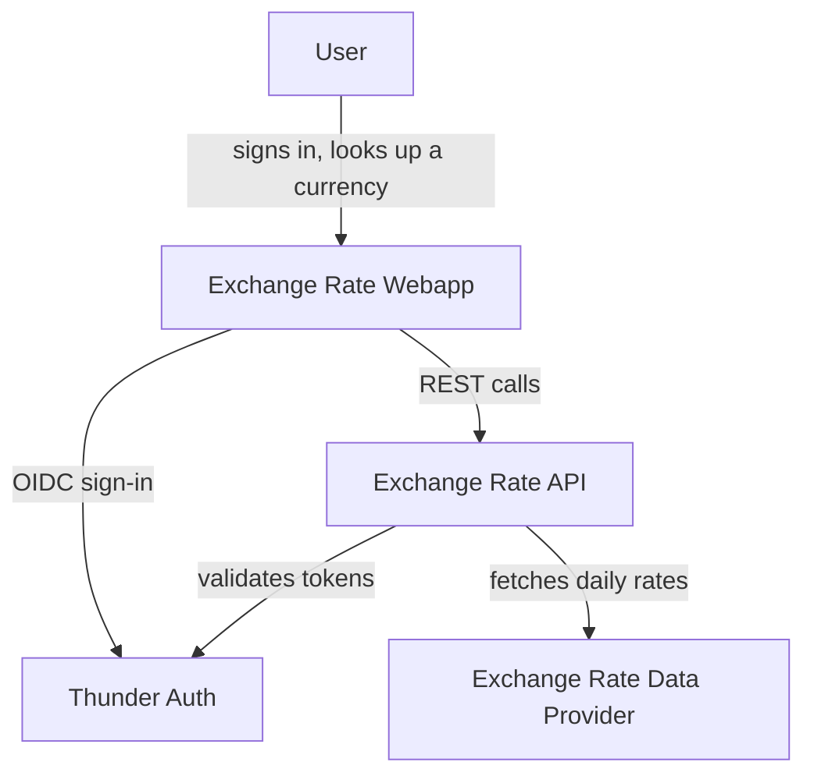
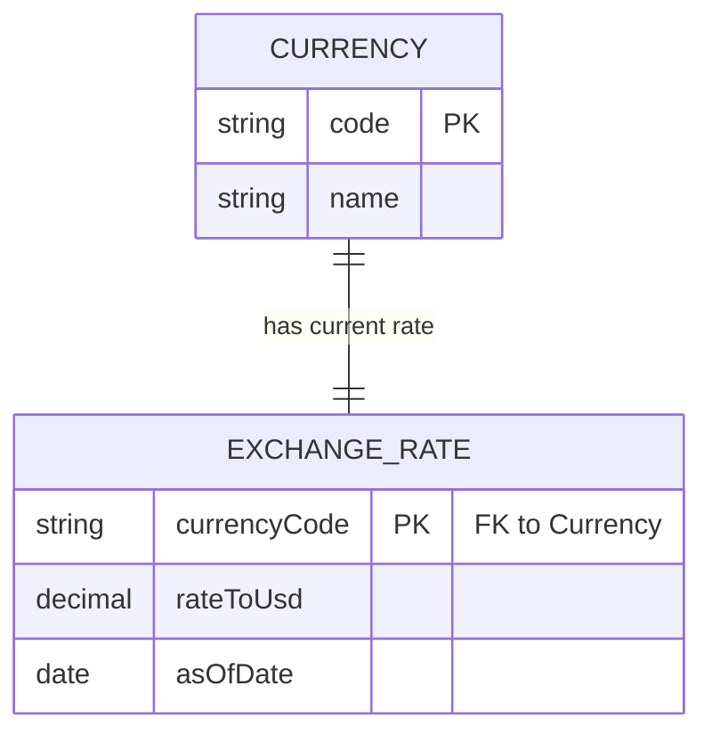
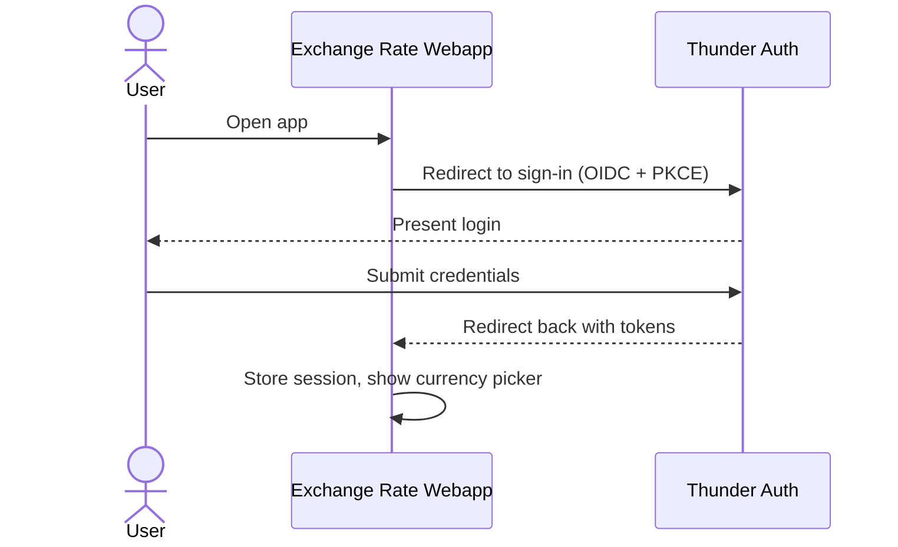
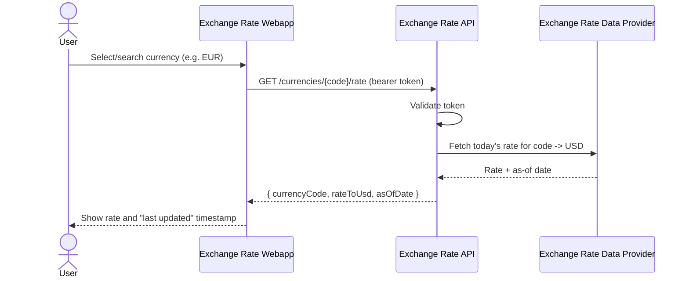

# Exchange Rate Lookup — Design

## Overview

A single-page webapp lets a signed-in user pick a currency and see its current exchange rate to USD, refreshed daily. `exchange-webapp` (React SPA) handles sign-in via Thunder and the currency-lookup UI; it calls `exchange-api` (Ballerina service), which resolves currencies and their daily USD rates from an external exchange-rate data provider and returns them to the webapp. The service layer keeps the external provider's details off the browser and gives the platform one place to cache/normalize daily rates.

## Context (C1)

## Domain model (ER)

## Key flows

### Sign-in

### Currency rate lookup

